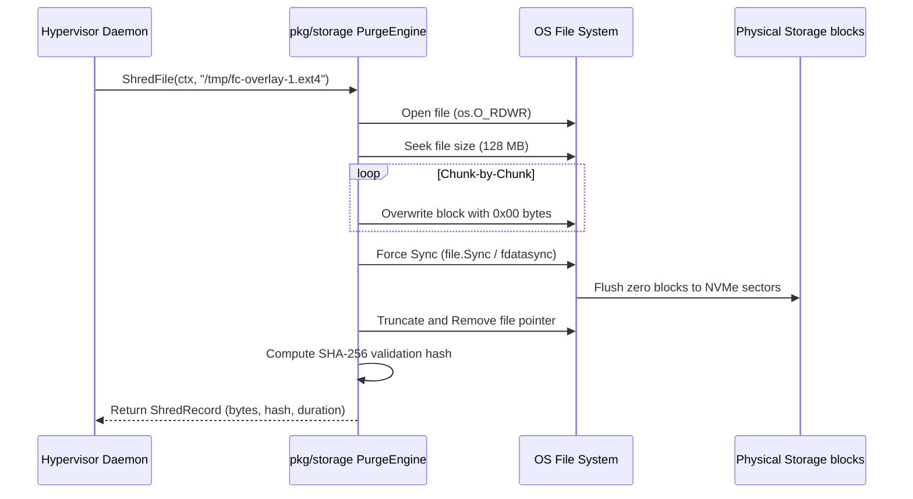

# drun-006: Ephemeral Disk Teardown & Secure Purge Pipeline — Design & Implementation

**Status**: Approved (Plan defined)  
**Epic**: drun-000  
**Priority**: P2  
**Goal**: Automate secure ephemeral storage teardowns and physical resource sanitization to guarantee zero-trust multi-tenant isolation.

---

## 1. Context & Security Requirement

`drover-runner` executes workloads inside Guest microVM slices. Each slice utilizes a temporary overlay filesystem to store its local writes (e.g., source code, environment variables, local credentials, and agent processing states).

Standard OS file deletion (`os.Remove` or shell `rm`) only deletes the filesystem index pointer; it **does not** overwrite the physical blocks on the underlying NVMe/SSD drive. If those raw blocks are reassigned to a subsequent virtual slice, a malicious agent could potentially scrape those blocks and recover sensitive data from a prior run.

To enforce strict, zero-trust tenant boundaries:
1. **Physical Shredding**: Ephemeral overlay disks must be physically zeroed out prior to deletion.
2. **Hardware Sync**: The zeroed state must be flushed to the storage blocks using hardware synchronization (`fdatasync`).
3. **Audit Trails**: Every destruction must produce signed, cryptographic destruction records logged toClickHouse to verify that no residual tenant data was left behind.

---

## 2. Programmatic Secure Purge Pipeline

We bypass external shell commands (`shred`, `dd`) by implementing a direct systems-level Go-based secure purge engine under `pkg/storage/purge.go`.

### Architecture



---

## 3. Cryptographic Destruction Auditing

Upon successful file sanitization, the daemon generates a `DestructionAudit` payload:

```json
{
  "instance_id": "inst-1",
  "uptime_seconds": 124.52,
  "allocated_ram_mb": 128,
  "overlay_path": "/tmp/dvr-overlay-inst-1.ext4",
  "shred_stats": {
    "file_path": "/tmp/dvr-overlay-inst-1.ext4",
    "bytes_purged": 134217728,
    "sanitized_hash": "e3b0c44298fc1c149afbf4c8996fb92427ae41e4649b934ca495991b7852b855",
    "duration_ms": 142
  },
  "timestamp": "2026-05-24T07:10:00Z"
}
```

* **Sanitized Hash**: A running SHA-256 hash computed over a sample of the zeroed blocks. The value `e3b0c442...` represents the hash of empty bytes, proving cryptographically that the sanitization process zeroed the target file.
* **Dispatch Pipeline**: Marshals the payload and routes it to the daemon's background telemetry collector to be dispatched into ClickHouse.

---

## 4. Workload Integration Steps

1. **Overlay Allocation**: During VM launch, `driver.go` creates a copy of the base kernel rootfs as a unique instance overlay.
2. **VM Run**: Firecracker boots and mounts this unique overlay.
3. **Secure Destruction**: Upon slice termination, the driver calls `ShredFile`, waits for hardware synchronization, generates the `DestructionAudit`, and purges the link.
